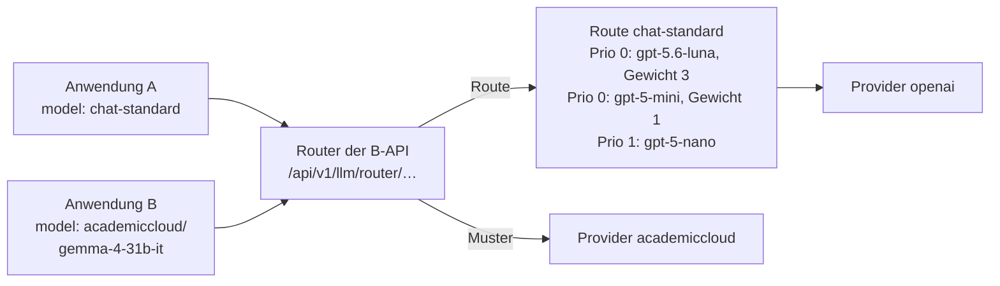
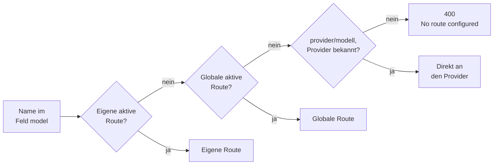
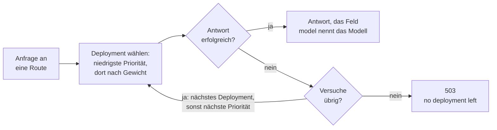
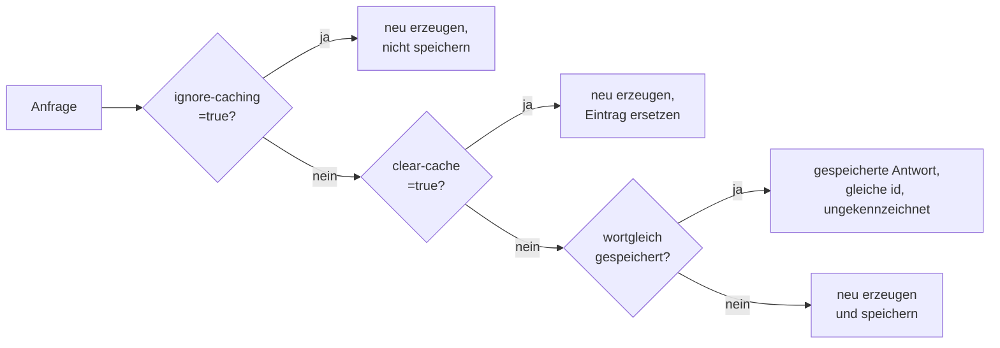
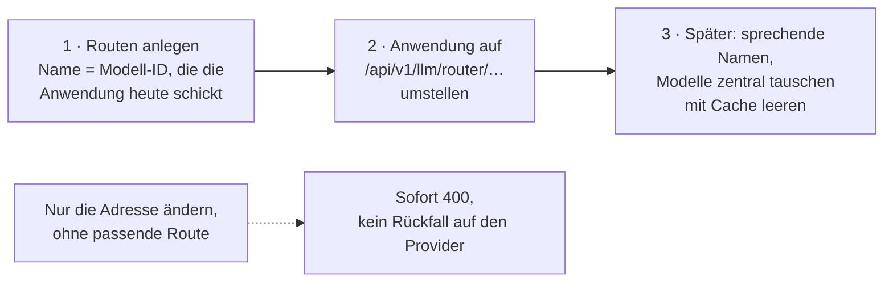

# LLM-Routing der B-API

**Anleitung, Funktionsweise und Testergebnisse** · Stand 2. Oktober 2026 ·
getestet am 1. Oktober 2026 gegen Staging (`https://b-api.staging.openeduhub.net`)

> Eine **Route** ist ein Name für eine Gruppe von KI-Modellen. Anwendungen
> schicken diesen Namen wie einen Modellnamen an die B-API — und die B-API
> entscheidet, welches Modell antwortet.

## Das Wichtigste in Kürze

- **Nutzen:** Anwendungen schicken den Routennamen im Feld `model` an
  `/api/v1/llm/router/…` (OpenAI-kompatibel). Ohne Route geht es mit
  `provider/modell`, etwa `openai/gpt-5.6-luna`.
- **Auswahl:** Zuerst kommen die Modelle mit Priorität 0 dran, verteilt nach
  Gewicht. Antwortet eines nicht, weicht die B-API auf das nächste aus.
- **Zwei Arten von Routen:** *Globale* Routen pflegen Administratoren für alle
  Konten. *Eigene* Routen gelten nur für die Schlüssel eines Kontos und gehen
  dort vor.
- **Drei Regeln:**
  1. Eine Route bündelt nur Modelle, die dieselben Anfrage-Parameter verstehen.
  2. Gleiche Anfragen kommen aus dem Cache — und Änderungen an einer Route
     leeren ihn nicht.
  3. Erst die Routen anlegen, dann die Anwendungen umstellen.
- **Getestet:** Die Kernfunktionen arbeiten wie beschrieben. Es gibt 13
  Abweichungen, vor allem bei Parametern, beim Cache und bei Fehlermeldungen —
  siehe [Testergebnisse](#6-testergebnisse).

**Inhalt:**
[1 Funktionsweise](#1-so-funktioniert-das-routing) ·
[2 Oberfläche](#2-routen-in-der-oberfläche) ·
[3 API](#3-routen-über-die-api) ·
[4 Worauf man achten muss](#4-worauf-man-achten-muss) ·
[5 Umstellen](#5-bestehende-anwendungen-umstellen) ·
[6 Testergebnisse](#6-testergebnisse) ·
[7 Fragen aus dem Team](#7-fragen-aus-dem-team) ·
[8 Empfehlungen und Offenes](#8-empfehlungen-und-offene-punkte)

---

## 1. So funktioniert das Routing



### Begriffe

| Begriff | In der Oberfläche | In der API | Bedeutung |
|---|---|---|---|
| Route | Routenname (Modell) | `logicalModel` | der Name, den Anwendungen als `model` schicken |
| Deployment | eine Zeile unter „Deployments" | ein Eintrag in `deployments` | ein Modell bei einem Provider |
| Provider | Provider | `providerId` | `openai` oder `academiccloud` |
| Modell | Modell beim Provider | `upstreamModel` | der Name des Modells beim Provider |
| Kennung | Kennung | `id` im Deployment | frei wählbar, je Route eindeutig; steht in Logs und Fehlermeldungen |
| Priorität | Priorität (in der Liste: „Stufe") | `priorityTier` | 0 kommt zuerst |
| Gewicht | Gewicht | `weight` | Anteil innerhalb einer Priorität; ganze Zahl ab 1 |
| Aktiv | Route aktiv / Aktiv | `enabled` | aus: Route unbekannt, Deployment übersprungen |
| Max. Versuche | Max. Versuche | `maxAttempts` | 1–10; leer = Standard der B-API |
| Cache leeren | Cache dieser Route beim Speichern leeren | `clearCache` | nur beim Ändern einer Route |

### Globale und eigene Routen

Beide sind gleich aufgebaut. Sie unterscheiden sich darin, wem sie gehören und
für wen sie gelten.

| | Globale Route | Eigene Route (Konto-Route) |
|---|---|---|
| Gehört | keinem Konto | genau einem Konto |
| Gilt für | alle Konten | die API-Schlüssel dieses Kontos |
| Gepflegt von | Administratoren: Seite „LLM-Routing" oder Admin-API | Administratoren am Konto (Tab „LLM-Routen") oder vom Konto selbst über die API, mit dem Recht `LLM_ROUTE_MANAGE` |
| Erkennbar an | `"accountId": null` | der `accountId` des Kontos |

- **Gleicher Name:** Für ein Konto gilt seine eigene aktive Route, alle anderen
  Konten nutzen die globale. Ist die eigene Route deaktiviert, gilt für das
  Konto laut Beschreibung wieder die globale.
- **Was ein Konto sieht:** `GET /api/v1/llm/router/routes` zeigt die eigenen
  Routen (auch deaktivierte) und die aktiven globalen — keine Routen anderer
  Konten. Globale Routen sind dort nur lesbar.

### Welcher Name wohin führt

Der Router prüft den Namen im Feld `model` in dieser Reihenfolge. Die erste
passende Stufe gilt.



- Eine Route, die selbst wie ein Muster heißt (`openai/spezial`), gewinnt vor
  dem Muster.
- Ein bloßer Modellname wie `gpt-5.6-luna` ist **kein** Muster. Ohne
  gleichnamige Route endet er mit 400.
- Das Muster lässt sich auf dem Server abschalten
  (`app.llm.routing.providerPrefixFallback=false`, Standard: an). Dann führen
  nur noch Routen ans Ziel.

**Das Muster `provider/modell` im Einzelnen:**

- Geteilt wird am ersten `/`: `academiccloud/meta-llama/Llama-3` meint das
  Modell `meta-llama/Llama-3` bei der AcademicCloud.
- Genau ein Ziel — keine Priorität, kein Gewicht, kein Ausweichen. Fehler des
  Providers kommen so zurück, wie er sie schickt.
- Es teilt den Cache mit dem direkten Aufruf (`/api/v1/llm/openai/…`).
- Rechte, Kontingente und Kosten gelten wie beim Provider.
- Das Muster steht nicht in `GET …/router/models`. In den Nutzungsdaten
  erscheint der Aufruf mit der Kennung `provider-prefix`.

### Wie eine Route ein Modell wählt



*Vereinfacht nach der Beschreibung der B-API. Getestet ist das Ausweichen auf
die nächste Priorität, nicht die Verteilung nach Gewicht.*

- **Priorität:** 0 kommt zuerst. Eine höhere Priorität ist erst dran, wenn in
  der niedrigeren keines antwortet — etwa 0 für die Hauptmodelle, 1 als
  Reserve.
- **Gewicht:** eine ganze Zahl ab 1, relativ innerhalb einer Priorität. 1 und 1
  heißt je etwa die Hälfte; 3, 1 und 1 heißt etwa 60, 20 und 20 Prozent. 0 und
  Kommazahlen lehnt der Server ab.
- **Aktiv:** Abgeschaltete Deployments werden übersprungen. Sind alle aus,
  antwortet die Route mit 503.
- **Max. Versuche:** laut API-Beschreibung die Höchstzahl an Aufrufen bei
  Providern je Anfrage. Gemessen wich eine Route mit dem Wert 1 trotzdem aus.
  Wer Ausweichen will, lässt das Feld leer oder setzt mindestens 2.
- **Pause nach Fehlern:** Ein nicht erreichbares Deployment merkt sich die
  B-API eine Weile und überspringt es. Administratoren sehen das unter
  `GET /administration/llm-routing/status`.
- **Keine Auslastung:** Die gemeldete Auslastung der AcademicCloud fließt nicht
  ein — verteilt wird nur nach Priorität und Gewicht.
- **Wer geantwortet hat,** steht nur im Feld `model` der Antwort (etwa
  `"gpt-5.6-luna"`) — ohne Provider und ohne Kennung.

### Eine Anfrage für alle Modelle einer Route

Der Router reicht die Anfrage **unverändert** an das gewählte Modell weiter.
Die Modellfamilien verstehen aber nicht dieselben Parameter:

| Familie | Grenze für die Länge | `temperature` | Beispiele |
|---|---|---|---|
| GPT-5 und o-Modelle (OpenAI) | `max_completion_tokens` | nur der Standardwert 1 | `gpt-5.6-luna`, `gpt-5-mini`, `gpt-5-nano` |
| ältere OpenAI-Modelle, AcademicCloud | `max_tokens` | frei wählbar | `gpt-4o`, `gemma-4-31b-it`, `deepseek-v4-flash-0731` |

**Darum gehören in eine Route nur Modelle einer Familie.** In einer gemischten
Route bekommt immer eines die falschen Parameter und antwortet mit 400.
Gemessen: `max_tokens` an eine Route mit `gpt-5.6-luna` ergab OpenAIs eigenen
Fehler *„Unsupported parameter: 'max_tokens' … Use 'max_completion_tokens'
instead."*

### Der Cache



- Eine **wortgleiche** Anfrage bekommt die gespeicherte Antwort zurück — in
  Millisekunden, mit derselben `id` und derselben Token-Zählung, und **nichts
  kennzeichnet sie**.
- Das gilt für Routen **und** für die direkten Provider-Aufrufe
  (`/api/v1/llm/openai/…`).
- Jede Route hat einen **eigenen** Cache; das Muster `provider/modell` nutzt den
  des Providers. Nach dem Umstieg auf eine Route beginnt der Cache also leer.
- **Änderungen an einer Route leeren den Cache nicht** — so sagt es auch die
  Oberfläche. Nach einem Modelltausch kommen sonst weiter Antworten des alten
  Modells. Darum beim Speichern „Cache dieser Route beim Speichern leeren"
  einschalten (API: `"clearCache": true`).
- Wer zur selben Frage bewusst neue Antworten will, etwa Varianten, muss den
  Cache je Anfrage umgehen (`?ignore-caching=true`).
- Wie lange Antworten gespeichert bleiben, ist von außen nicht zu sehen.

---

## 2. Routen in der Oberfläche

### Eine globale Route anlegen (Administratoren)

1. Links **„LLM-Routing"** öffnen. Die Seite listet alle globalen Routen mit
   Routenname, Deployments „in Reihenfolge der Nutzung" (mit Stufe und
   Gewicht), Status, Datum der letzten Änderung und Aktionen. Der Abschnitt
   „So funktioniert das Routing" klappt eine Kurzerklärung auf.
2. **„Route hinzufügen"** öffnet den Dialog „Route anlegen (global)".
3. Die Felder ausfüllen, weitere Modelle mit **„Deployment hinzufügen"**.
4. **„Speichern"** — die Route ist sofort nutzbar.

| Feld | Pflicht | Hinweis |
|---|---|---|
| Routenname (Modell) | ja | Den Namen schicken die Anwendungen als `model`. Sprechend wählen, etwa `chat-standard`. |
| Max. Versuche | nein | 1–10, leer = Standard der B-API. Für Ausweichen nicht auf 1 setzen. |
| Beschreibung | nein | Freier Text, etwa wofür die Route da ist. |
| Route aktiv | – | Aus: Der Name ist sofort unbekannt (400). |
| **je Deployment:** Provider | ja | `openai` oder `academiccloud` |
| Modell beim Provider | ja | Die Liste schlägt die Modelle des Providers vor. Antworten können nur Modelle mit Preis („Model Pricing"). |
| Kennung | ja | Je Route eindeutig. Vorbelegt (etwa `academiccloud-1`), frei änderbar; sie muss nicht zum Provider passen. |
| Priorität | ja | 0 kommt zuerst. |
| Gewicht | ja | Ganze Zahl ab 1. |
| Aktiv | – | Aus: Das Deployment wird übersprungen. |

### Eine Route ändern oder löschen

- Das **Stift-Symbol** öffnet „Route bearbeiten". Zusätzlich gibt es dort den
  Schalter **„Cache dieser Route beim Speichern leeren"**. Die Oberfläche sagt
  dazu selbst: Änderungen leeren den Cache nicht automatisch; gespeicherte
  Antworten bleiben, auch wenn Deployments oder Modelle getauscht werden.
- Das **Papierkorb-Symbol** löscht die Route. Das wirkt sofort: Anwendungen,
  die den Namen schicken, bekommen 400.

### Eigene Routen eines Kontos

- Administratoren pflegen sie unter **„Accounts"** am jeweiligen Konto im Tab
  **„LLM-Routen"** — mit denselben Feldern.
- Konten mit dem Recht `LLM_ROUTE_MANAGE` pflegen ihre Routen auch selbst über
  die API (Abschnitt 3).

---

## 3. Routen über die API

Angemeldet wird jeder Aufruf mit dem Header `X-API-KEY: <Schlüssel>`;
`Authorization: Bearer <Schlüssel>` geht auch. Ohne oder mit falschem Schlüssel
kommt 401. Die vollständige Beschreibung steht in der Swagger-UI der B-API,
Gruppe „API Router" (`/v3/api-docs/router`).

### Die Endpunkte

**Nutzen** — OpenAI-kompatibel, alle unter `/api/v1/llm/router/`:

| Endpunkt | Wofür |
|---|---|
| `GET models` | die Namen der nutzbaren Routen |
| `POST chat/completions` | Chat |
| `POST responses`, `POST responses/input_tokens` | Responses-API, Token zählen |
| `POST completions` | ältere Textvervollständigung |
| `POST embeddings` · `POST moderations` | Vektoren · Moderation |
| `POST images/generations`, `images/edits`, `images/variations` | Bilder |
| `POST audio/speech`, `audio/transcriptions`, `audio/translations` | Sprache |

Jeder Endpunkt funktioniert nur mit Modellen, die das jeweilige können — etwa
`embeddings` nur mit einem Embedding-Modell.

**Eigene Routen verwalten** — mit dem Recht `LLM_ROUTE_MANAGE`:

| Endpunkt | Wofür |
|---|---|
| `GET /api/v1/llm/router/routes` | eigene und aktive globale Routen, mit allen Deployments |
| `POST /api/v1/llm/router/routes` | eine Route für das eigene Konto anlegen |
| `PUT /api/v1/llm/router/routes/{id}` | eine eigene Route ersetzen |
| `DELETE /api/v1/llm/router/routes/{id}` | eine eigene Route löschen |

**Globale Routen verwalten** — für Administratoren, Gruppe „Administration" der
Swagger-UI. *Laut API-Beschreibung; nicht live getestet.*

| Endpunkt | Wofür |
|---|---|
| `GET /administration/llm-routing/groups` | Routen auflisten (Parameter `accountId`) |
| `POST /administration/llm-routing/groups` | eine Route anlegen; leere `accountId` = global |
| `PUT /administration/llm-routing/groups/{id}` | eine Route ersetzen |
| `DELETE /administration/llm-routing/groups/{id}` | eine Route löschen |
| `GET /administration/llm-routing/providers` | die verfügbaren Provider |
| `GET /administration/llm-routing/status` | Zustand der Deployments: Fehler in Folge, Pause, letzter Fehler |
| `DELETE /administration/llm-routing/status?key=…` | den Zustand eines Deployments zurücksetzen |
| `POST /administration/llm-routing/reload` | die Routing-Konfiguration neu laden |

Die Zugehörigkeit einer Route (`accountId`) lässt sich nach dem Anlegen nicht
mehr ändern.

### Schritt für Schritt — mit Beispielen

Für die Kommandozeile (macOS, Linux oder Git Bash unter Windows). Vorher
einmal setzen:

```bash
export B=https://b-api.staging.openeduhub.net
export B_API_KEY=...   # eigener Schlüssel; nie in Dateien, Tickets oder Chats kopieren
```

#### 1. Welche Routen kann ich nutzen?

```bash
curl -s "$B/api/v1/llm/router/models" -H "X-API-KEY: $B_API_KEY"
```

```json
{"object": "list", "data": [
  {"id": "my-fancy-llm-route", "object": "model", "created": 0, "owned_by": "router"}
]}
```

Jeder Eintrag in `data` ist ein Name, den man als `model` schicken kann. Hier
stehen nur aktive Routen; das Muster `provider/modell` steht nie darin.

#### 2. Was steckt hinter einer Route?

```bash
curl -s "$B/api/v1/llm/router/routes" -H "X-API-KEY: $B_API_KEY"
```

<details>
<summary>Antwort (eine globale Route)</summary>

```json
[{
  "id": "<id der Route>",
  "accountId": null,
  "logicalModel": "my-fancy-llm-route",
  "description": "Hello World",
  "enabled": true,
  "deployments": [
    {"id": "academiccloud-1", "providerId": "academiccloud", "upstreamModel": "gemma-4-31b-it",
     "priorityTier": 0, "weight": 3, "enabled": true},
    {"id": "academiccloud-2", "providerId": "openai", "upstreamModel": "ft:gpt-4o-2024-11-20",
     "priorityTier": 0, "weight": 1, "enabled": true},
    {"id": "academiccloud-3", "providerId": "academiccloud", "upstreamModel": "deepseek-v4-flash-0731",
     "priorityTier": 0, "weight": 1, "enabled": true}
  ],
  "maxAttempts": 1,
  "createdAt": "2026-09-30T13:03:51.535",
  "updatedAt": "2026-09-30T13:05:46.203"
}]
```

</details>

- `"accountId": null` heißt: eine globale Route.
- Drei Modelle mit Priorität 0 und den Gewichten 3, 1 und 1: gemma bekommt
  etwa 60 Prozent der Anfragen, die beiden anderen je etwa 20.
- Die Kennung ist nur ein Etikett — `academiccloud-2` ist hier ein
  OpenAI-Modell. Sprechende Kennungen machen Logs lesbarer.
- Die Zeitstempel sind UTC, auch ohne angehängtes „Z".

#### 3. Ein Modell ohne Route ansprechen

```bash
curl -s "$B/api/v1/llm/router/chat/completions" \
  -H "X-API-KEY: $B_API_KEY" -H "Content-Type: application/json" \
  -d '{"model": "openai/gpt-5.6-luna",
       "messages": [{"role": "user", "content": "Antworte nur mit OK."}],
       "max_completion_tokens": 200}'
```

<details>
<summary>Antwort (gekürzt)</summary>

```json
{
  "id": "chatcmpl-EUFFZioMaCNQMw5vxQwgH9Vj3JrSR",
  "object": "chat.completion",
  "created": 1790877169,
  "model": "gpt-5.6-luna",
  "choices": [{"index": 0, "message": {"role": "assistant", "content": "OK"},
               "finish_reason": "stop"}],
  "usage": {"prompt_tokens": 13, "completion_tokens": 4, "total_tokens": 17}
}
```

</details>

- `choices[0].message.content` ist der Text.
- `model` nennt das Modell, das geantwortet hat — ohne Provider.
- `finish_reason: "stop"` heißt fertig; `"length"` heißt, die Längengrenze war
  erreicht und der Text bricht ab.

#### 4. Eine eigene Route anlegen

```bash
curl -s -X POST "$B/api/v1/llm/router/routes" \
  -H "X-API-KEY: $B_API_KEY" -H "Content-Type: application/json" \
  -d '{"logicalModel": "mein-chat",
       "description": "luna zuerst, nano als Reserve",
       "deployments": [
         {"id": "luna", "providerId": "openai", "upstreamModel": "gpt-5.6-luna", "priorityTier": 0, "weight": 1},
         {"id": "nano", "providerId": "openai", "upstreamModel": "gpt-5-nano", "priorityTier": 1, "weight": 1}
       ],
       "maxAttempts": 2}'
```

<details>
<summary>Antwort</summary>

```json
{
  "id": "6abe9df358dbc8d00c8a36ae",
  "accountId": "<eure Konto-ID>",
  "logicalModel": "mein-chat",
  "description": "luna zuerst, nano als Reserve",
  "enabled": true,
  "deployments": [
    {"id": "luna", "providerId": "openai", "upstreamModel": "gpt-5.6-luna",
     "priorityTier": 0, "weight": 1, "enabled": true},
    {"id": "nano", "providerId": "openai", "upstreamModel": "gpt-5-nano",
     "priorityTier": 1, "weight": 1, "enabled": true}
  ],
  "maxAttempts": 2,
  "createdAt": "2026-10-01T17:52:51.060451197",
  "updatedAt": "2026-10-01T17:52:51.060474642"
}
```

</details>

- Pflicht sind `logicalModel` und mindestens ein Deployment mit `id`,
  `providerId` und `upstreamModel`. Ohne Angabe gelten Priorität 0, Gewicht 1
  und aktiv; ohne `maxAttempts` der Standard der B-API.
- Beide Modelle sind GPT-5-Modelle und verstehen dieselben Parameter.
- Die Route ist sofort nutzbar. Ihre `id` braucht man zum Ändern und Löschen:
  `export ROUTE_ID=6abe9df358dbc8d00c8a36ae`
- Gibt es im Konto schon eine Route dieses Namens, kommt 409.

#### 5. Die Route nutzen

```bash
curl -s "$B/api/v1/llm/router/chat/completions" \
  -H "X-API-KEY: $B_API_KEY" -H "Content-Type: application/json" \
  -d '{"model": "mein-chat",
       "messages": [{"role": "user", "content": "Antworte nur mit OK."}],
       "max_completion_tokens": 200}'
```

Die Antwort sieht aus wie in Schritt 3. `"model": "gpt-5.6-luna"` zeigt, dass
das Deployment mit Priorität 0 geantwortet hat; antwortet luna nicht, kommt
nano dran.

#### 6. Die Route ändern

```bash
curl -s -X PUT "$B/api/v1/llm/router/routes/$ROUTE_ID" \
  -H "X-API-KEY: $B_API_KEY" -H "Content-Type: application/json" \
  -d '{"logicalModel": "mein-chat",
       "description": "nur luna, Reserve aus",
       "deployments": [
         {"id": "luna", "providerId": "openai", "upstreamModel": "gpt-5.6-luna", "priorityTier": 0, "weight": 1},
         {"id": "nano", "providerId": "openai", "upstreamModel": "gpt-5-nano", "priorityTier": 1, "weight": 1, "enabled": false}
       ],
       "maxAttempts": 2,
       "clearCache": true}'
```

- `PUT` **ersetzt** die ganze Route — darum immer alle Felder und alle
  Deployments mitschicken, nicht nur die geänderten.
- `"clearCache": true` verwirft die gespeicherten Antworten dieser Route.
- Die Antwort ist die gespeicherte Route mit derselben `id` und neuem
  `updatedAt`. Die Änderung wirkt sofort.

#### 7. Die Route löschen

```bash
curl -s -o /dev/null -w "%{http_code}\n" -X DELETE \
  "$B/api/v1/llm/router/routes/$ROUTE_ID" -H "X-API-KEY: $B_API_KEY"
```

Ausgabe: `200` — die Antwort selbst ist leer. Eine unbekannte `id` ergibt
`404`. Danach antwortet der Name sofort mit 400.

#### 8. Am Cache vorbei fragen

Wie Schritt 5, nur mit `?ignore-caching=true` an der Adresse
(`…/router/chat/completions?ignore-caching=true`): Die Antwort ist neu erzeugt,
hat eine neue `id` und wird nicht gespeichert. Mit `?clear-cache=true` ersetzt
sie die gespeicherte.

---

## 4. Worauf man achten muss

**Beim Anlegen einer Route**

- **Nur eine Modellfamilie je Route** — sonst scheitert immer eines der Modelle
  an den Parametern ([Abschnitt 1](#eine-anfrage-für-alle-modelle-einer-route)).
- **Modellnamen genau prüfen.** Die API nimmt jeden Namen an, auch einen, den
  es nicht gibt; der Fehler zeigt sich erst beim ersten Aufruf. In der
  Oberfläche aus der Vorschlagsliste wählen.
- **Nur Modelle mit Preis antworten** (Admin-Bereich „Model Pricing"), sonst
  kommt 503.
- **Endpunkt und Modell müssen zusammenpassen** — `embeddings` braucht ein
  Embedding-Modell. Die B-API prüft das erst beim Aufruf.
- **Reserve über eine höhere Priorität** einrichten, und „Max. Versuche" dann
  nicht auf 1 setzen.
- **Gewichte als ganze Zahlen** — 50/50 heißt 1 und 1.
- **Sprechende, eindeutige Kennungen** — sie stehen in Logs und Fehlermeldungen.

**Beim Ändern einer Route**

- **Modelle nur innerhalb ihrer Familie tauschen.** Wird eine Route von gemma
  auf ein GPT-5-Modell umgestellt, scheitern Anwendungen, die `max_tokens`
  schicken, ab sofort mit 400.
- **„Cache leeren" einschalten**, sonst kommen weiter Antworten des alten
  Modells.
- **Routen nicht umbenennen, löschen oder abschalten**, solange Anwendungen den
  Namen nutzen — das wirkt sofort.
- **`PUT` ersetzt alles**: immer die vollständige Route schicken.

**Bei der Nutzung**

- **Wortgleiche Anfragen kommen aus dem Cache**, ohne Kennzeichnung. Für neue
  Antworten `?ignore-caching=true` anhängen.
- **Welches Modell geantwortet hat,** steht im Feld `model` der Antwort.
- **Bei 503 erst die Meldung lesen:** Fehlender Preis, kein aktives Deployment
  und ein ungeeignetes Modell kommen alle als 503 — Wiederholen hilft dann
  nicht.
- **Tippfehler mit Provider-Präfix** — `openai/mein-chatt` statt `mein-chat` —
  gehen an den Provider und enden mit 503 „Model pricing unavailable", nicht
  als unbekannte Route.

**Rechte**

- **`LLM_ROUTE_MANAGE` nur an Schlüssel für die Verwaltung** vergeben, nicht an
  Schlüssel von Anwendungen.

### Fehlermeldungen

| Status | Antwort | Bedeutung | Was tun |
|---|---|---|---|
| 400 | `{"error": "No route configured for model 'x'"}` | Name unbekannt, Route deaktiviert, oder ein Modellname ohne Provider-Präfix | Namen prüfen (`GET …/router/models`) oder `provider/modell` schicken |
| 400 | `{"error": {"message": "Unsupported parameter: 'max_tokens' …"}}` | Parameter passen nicht zum Modell; die Meldung kommt vom Provider | Parameter an die Modellfamilie anpassen |
| 503 | `{"error": "Model pricing unavailable for 'x' - cannot enforce cost quota"}` | Modell ohne Preis, oft ein Tippfehler hinter `openai/…` | Modellnamen prüfen; nicht wiederholen |
| 503 | `{"error": "No deployment could serve model 'x' (no deployment left)"}` | kein aktives oder erreichbares Deployment | Deployments prüfen; nur bei kurzem Ausfall wiederholen |
| 503 | `… attempts: …:NOT_ELIGIBLE (HTTP 403)` | das Modell kann diesen Endpunkt nicht | passendes Modell wählen; nicht wiederholen |
| 401 | leer | Schlüssel fehlt oder ist falsch | Header prüfen |
| 400 | `{"error": "Deployment ids must be unique within a route group"}` | eine Kennung kommt doppelt vor | Kennungen eindeutig machen |
| 400 | `{"error": "Unknown provider 'x' in deployment 'y'"}` | den Provider gibt es nicht | `openai` oder `academiccloud` |
| 400 | `{"deployments[0].weight": "must be greater than 0"}` | eine Feldprüfung; vorne steht das Feld | Wert korrigieren |
| 409 | `{"error": "The account already has a route group for model 'x'"}` | der Name ist im Konto schon vergeben | anderen Namen wählen oder die Route ändern |
| 404 | leer | die `id` gibt es nicht | `id` aus `GET …/routes` nehmen |

Regelverstöße kommen als `{"error": "…"}`, Feldprüfungen als
`{"<feld>": "<meldung>"}`. Wer Antworten maschinell liest, sollte beide Formen
erwarten.

---

## 5. Bestehende Anwendungen umstellen

Eine Anwendung, die bisher `/api/v1/llm/openai/chat/completions` aufruft, ruft
künftig `/api/v1/llm/router/chat/completions` auf. Auf die Reihenfolge kommt
es an:



1. **Zuerst die Routen, dann die Anwendungen.** Wer nur die Adresse ändert und
   weiter `"model": "gpt-5.6-luna"` schickt, bekommt sofort 400, solange es
   keine Route dieses Namens gibt.
2. **Zwei Wege ohne Ausfall:**
   - Routen anlegen, die genau so heißen wie die Modelle, die die Anwendungen
     heute schicken (Route `gpt-5.6-luna` → openai / gpt-5.6-luna). Dann reicht
     die neue Adresse; später auf sprechende Namen wie `chat-standard`
     umziehen.
   - Oder die Anwendungen schicken `provider/modell`, etwa
     `openai/gpt-5.6-luna`. Das geht ohne Route und nutzt den bisherigen Cache
     weiter — zentral tauschen lässt sich das Modell so aber nicht.
3. **Timing:** Auf Staging wirkte jede Änderung sofort — Anlegen, Ändern,
   Abschalten, Löschen. Ob das bei mehreren B-API-Instanzen genauso gilt, ist
   offen.
4. **Der Cache beginnt nach dem Umstieg leer:** Die ersten Anfragen kommen
   nicht mehr aus dem bisherigen Provider-Cache.

---

## 6. Testergebnisse

### Rahmen

| | |
|---|---|
| Instanz und Datum | Staging, 1. Oktober 2026, ca. 12:10–13:20 UTC |
| Konto | eigener API-Schlüssel mit dem Recht `LLM_ROUTE_MANAGE` |
| Modelle | erzeugende Aufrufe nur an `openai/gpt-5.6-luna`; ein zweites Deployment nannte absichtlich ein Modell, das es nicht gibt |
| Testdaten | Wegwerf-Routen im eigenen Konto, alle wieder gelöscht und das Löschen nachgeprüft |
| Globale Routen | nur gelesen, nie geändert |

### Bestätigt

| Funktion | Gemessen |
|---|---|
| Anfragen über eine Route (`chat/completions`, `responses`) | 200, Antwort im OpenAI-Format |
| Muster `provider/modell` ohne Route | 200 in 1,9 s mit `openai/gpt-5.6-luna` |
| Eigene Routen anlegen, ändern, löschen über die API | 200; jede Änderung wirkt sofort, eine gelöschte Route antwortet sofort mit 400 |
| Eigene Route vor globaler Route gleichen Namens | die eigene antwortet (luna statt der Modelle der globalen Route) |
| Route mit Musternamen vor dem Muster | die Route gewinnt |
| Unbekannter, deaktivierter oder gelöschter Name | 400 „No route configured" |
| Ausweichen auf die nächste Priorität | Priorität 0 mit einem Modell ohne Preis, Priorität 1 luna: luna antwortet |
| Deployments abschalten | alle aus → sofort 503, wieder an → sofort 200 |
| Cache der Provider und der Routen | Wiederholung in 0,05–0,06 s mit derselben `id`; das Muster teilt den Provider-Cache, eine Route hat einen eigenen |
| `ignore-caching`, `clear-cache`, `clearCache` | wirken wie beschrieben |
| Prüfung beim Anlegen | doppelte Kennungen, unbekannte Provider, Gewicht 0, `maxAttempts` außerhalb 1–10, leere Namen und Listen: 400; doppelter Routenname: 409 |
| Sichtbarkeit | `/routes`: eigene und aktive globale Routen; `/models`: nur aktive; das Muster in keiner Liste |
| Standardwerte | Priorität 0, Gewicht 1, aktiv; `maxAttempts` leer |
| Anmeldung | `X-API-KEY` und `Authorization: Bearer`; ohne oder mit falschem Schlüssel 401 |

### Abweichungen

| Nr. | Befund | Folge | Vorschlag |
|---|---|---|---|
| B1 | Die Anfrage geht unverändert an jedes Deployment | eine Route kann nur Modelle einer Parameter-Familie bündeln | Parameter je Deployment anpassen oder Mischrouten beim Anlegen ablehnen |
| B2 | `maxAttempts`: die erste Beschreibung sagt „Versuche je Modell", die API-Beschreibung „Aufrufe je Anfrage"; mit 1 wurde trotzdem ausgewichen | unklar, wann eine Route aufgibt | Bedeutung festlegen, überall gleich beschreiben |
| B3 | Gewichte sind ganze Zahlen ab 1; die API-Beschreibung erlaubt 0, der Server nicht | „0,5 = 50/50" aus der ersten Beschreibung geht nicht | ganze Zahlen dokumentieren |
| B4 | Gecachte Antworten sind nicht gekennzeichnet — auch bei den Provider-Pfaden | frisch und gespeichert nicht unterscheidbar | Kopfzeile `X-Cache: HIT/MISS`, Lebensdauer dokumentieren |
| B5 | Welches Deployment geantwortet hat, sagt nur das Feld `model` | Gewichtung und Ausweichen von außen nicht nachprüfbar | Kopfzeilen `X-Route`, `X-Route-Deployment` |
| B6 | Tippfehler mit Provider-Präfix → 503 statt 400 | Clients wiederholen umsonst | 400 mit klarer Meldung |
| B7 | Route ohne aktives Deployment: in `/models` gelistet, Aufruf 503 | „falsch eingerichtet" sieht aus wie „gleich wieder da" | nicht listen; 503 nur für Vorübergehendes |
| B8 | 409 (doppelter Name) und 404 (unbekannte `id`, ohne Meldung) fehlen in der API-Beschreibung | Clients rechnen nicht damit | ergänzen, Meldung mitschicken |
| B9 | Zwei Fehlerformen: `{"error": …}` und `{"<feld>": …}` | Clients müssen beide lesen | eine Form |
| B10 | Zeitstempel ohne Zeitzone (sind UTC) | missverständlich | mit `Z` ausgeben |
| B11 | `accountId` laut API-Beschreibung „leer = global"; am Konto-Endpunkt wird die Route dem eigenen Konto zugeordnet | missverständlich | Text anpassen |
| B12 | Modell am falschen Endpunkt → 503 `NOT_ELIGIBLE` | Dauerfehler sieht vorübergehend aus | 400 mit klarer Meldung |
| B13 | Beim Anlegen wird das Modell nicht geprüft | Tippfehler zeigen sich erst beim Aufruf | prüfen oder warnen |

### Nicht getestet

Die Verteilung nach Gewicht und das Ausweichen nach einem echten Ausfall
(beides braucht unterscheidbare Modelle), die Pause nach Fehlern, andere
Endpunkte mit passenden Modellen, die Admin-Endpunkte, mehrere
B-API-Instanzen und das Abschalten des Musters. Hinweise zur Prüfung der
Rechtevergabe gingen gesondert an das B-API-Team.

<details>
<summary>Einzelmessungen zur Umstellung (T1–T5)</summary>

| Nr. | Messung | Ergebnis |
|---|---|---|
| T1 | Anwendung stellt nur die Adresse um, schickt weiter `model: "gpt-5.6-luna"`, keine Route | sofort 400 „No route configured for model 'gpt-5.6-luna'" |
| T2 | Route anlegen, die genau wie das Modell heißt, dieselbe Anfrage | 200, direkt nach dem Anlegen |
| T3 | Dieselbe Frage erst direkt beim Provider, dann über eine Route | neue Antwort (andere `id`, 1,4 s): die Route hat einen eigenen Cache |
| T4 | Route ändern ohne `clearCache` · mit `clearCache` | alte Antwort aus dem Cache (0,11 s, gleiche `id`) · neue Antwort |
| T4 | Deployment abschalten · wieder einschalten | sofort 503 „no deployment left" · sofort 200 |
| T5 | Chat-Modell an `/router/embeddings`, als Muster und als Route | 503 „… NOT_ELIGIBLE (HTTP 403)" |

</details>

### Richtigstellungen zur ersten Beschreibung

- **Gewichte** sind ganze Zahlen ab 1 — 50/50 heißt 1 und 1, nicht 0,5.
- **„Die Modelle müssen die Funktion unterstützen"** reicht nicht: Sie müssen
  auch dieselben Anfrage-Parameter verstehen.
- **Tippfehler mit Provider-Präfix** enden mit 503 „Model pricing
  unavailable", nicht als unbekannte Route.
- **Der Cache** gilt auch für die direkten Provider-Aufrufe und überlebt
  Änderungen an der Route.
- **„Max. Versuche"** zählt laut API-Beschreibung Aufrufe je Anfrage, nicht
  Versuche je Modell — offen.

---

## 7. Fragen aus dem Team

**Ist das live getestet — ist nachgewiesen, dass es funktioniert?**
Ja, am 1. Oktober gegen Staging: Anfragen über Routen und über
`provider/modell`, eigene Routen anlegen, ändern und löschen, der Vorrang
eigener Routen, das Ausweichen auf die nächste Priorität, der Cache und seine
Schalter. Was genau bestätigt ist, steht unter
[Testergebnisse](#6-testergebnisse). Nicht nachgewiesen sind die Verteilung
nach Gewicht und das Ausweichen nach einem echten Ausfall — dafür braucht es
mehrere unterscheidbare Modelle.

**Was passiert, wenn bestehende Zugriffe auf `/router/` umgestellt werden,
ohne dass eine Route konfiguriert ist? Müssen wir auf Reihenfolge und Timing
achten?**
Ohne Route kommt sofort `400 No route configured for model '…'` — einen
Rückfall auf den Provider gibt es nicht. Auf die Reihenfolge kommt es also an:
erst die Routen, dann die Anwendungen. Beim Timing kaum: Auf Staging wirkte
jede Änderung sofort. Einplanen sollte man zweierlei: Der Cache einer neuen
Route beginnt leer, und ob Änderungen bei mehreren B-API-Instanzen ebenso
sofort wirken, ist noch nicht geprüft. Der Weg ohne Ausfall steht unter
[Bestehende Anwendungen umstellen](#5-bestehende-anwendungen-umstellen).

**Stimmt die Annahme: globale Route als Admin anlegen, Apps auf die
Routing-Endpunkte umstellen — und danach neue Modelle ohne Änderung der ENV
ausliefern?**
Ja, mit zwei Bedingungen. Das neue Modell muss dieselben Anfrage-Parameter
verstehen wie das alte (GPT-5-Modelle brauchen `max_completion_tokens`, gemma
oder gpt-4o nehmen `max_tokens`) — sonst scheitern die Anwendungen sofort mit
400. Und beim Speichern den Cache leeren, sonst bekommen wortgleiche Anfragen
weiter Antworten des alten Modells. Voraussetzung ist, dass die Anwendungen
einen Routennamen schicken und nicht `provider/modell`.

**Kann man alle Modelle des Providers in den URL-Pfad einfügen?**
Nicht in den Pfad — der bleibt `/api/v1/llm/router/chat/completions` —,
sondern in das Feld `model`: `openai/<modell>` oder `academiccloud/<modell>`.
So ist jedes Modell erreichbar, für das die B-API einen Preis hat; genauso wie
schon bisher direkt über `/api/v1/llm/openai/…`. Ein Modell ohne Preis weist
die B-API mit `503 Model pricing unavailable` ab, bevor der Provider gefragt
wird.

**Prüft der Router, ob ein Modell die Fähigkeiten für den Endpunkt hat?**
Beim Anlegen nicht: Eine Route nimmt jedes Modell an, auch eines, das es nicht
gibt. Beim Aufruf schon: Ein Chat-Modell an `/router/embeddings` wurde
abgewiesen — allerdings mit `503 … NOT_ELIGIBLE` statt einer klaren 400. Und
ob die Anfrage-Parameter zum Modell passen, prüft niemand (Befund B1). Welches
Modell zu welchem Endpunkt passt, muss man also selbst wissen.

**Wie hoch ist die Hürde, böswillig ein teures Modell einzuhängen?**
Eine eigene Route anlegen oder ändern kann nur, wer den Schlüssel eines Kontos
mit dem Recht `LLM_ROUTE_MANAGE` hat; globale Routen pflegen Administratoren.
Beim Anlegen prüft die B-API das Modell nicht — eingetragen werden kann jedes
Modell der freigegebenen Provider. Antworten kommen aber nur von Modellen, die
in der B-API einen Preis haben, und die sind mit demselben Schlüssel auch ohne
Router direkt erreichbar. Der Router öffnet also keinen neuen Weg zu teuren
Modellen; er macht den Austausch hinter einem Namen bequem. Genau deshalb
gehört das Recht, Routen zu ändern, nicht in die Schlüssel von Anwendungen.
Empfehlungen: `LLM_ROUTE_MANAGE` nur für Verwaltungsschlüssel, teure Modelle,
die niemand braucht, ohne Preis lassen, Kontingente je Konto setzen und
Routenänderungen protokollieren. Weitere Sicherheitshinweise gingen gesondert
an das B-API-Team.

**Ist das Risiko bei globalen Routen geringer als bei persönlichen?**
Das Risiko liegt an verschiedenen Stellen. Eine globale Route pflegen nur
Administratoren, sie gilt aber für alle Konten — ein Fehler dort trifft sofort
jede Anwendung, die den Namen nutzt. Eine persönliche Route gilt nur für die
Schlüssel ihres Kontos und überdeckt dort eine globale Route gleichen Namens;
ihr Risiko liegt bei jedem, der in diesem Konto einen Schlüssel mit
`LLM_ROUTE_MANAGE` hat. Faustregel: Routen, die mehrere Anwendungen teilen,
global pflegen; persönliche Routen für Erprobung und Sonderfälle, angelegt mit
einem eigenen Verwaltungsschlüssel.

**Ersetzt das Routing die Einschränkung der Modelle über Umgebungsvariablen?**
Teilweise. Routen legen zentral fest, welches Modell eine Anwendung bekommt —
das ersetzt die Modellnamen in der ENV. Eine Grenze für den Schlüssel sind sie
nicht: Wer ihn hat, erreicht jedes bepreiste Modell der freigegebenen Provider
auch direkt. Nachhaltig und skalierbar wäre eine Freigabeliste von Modellen je
Konto in der B-API.

---

## 8. Empfehlungen und offene Punkte

**An die Entwicklung der B-API**, nach Wirkung geordnet:

1. Parameter je Deployment anpassen — oder Routen aus verschiedenen
   Modellfamilien beim Anlegen ablehnen (B1).
2. Dauerfehler als 400 statt 503 melden; 503 nur für Vorübergehendes, dann mit
   `Retry-After` (B6, B7, B12).
3. Gecachte Antworten kennzeichnen und die Lebensdauer des Caches dokumentieren
   (B4).
4. Antwortende Route und Deployment als Kopfzeilen mitsenden (B5).
5. Das Modell beim Anlegen prüfen oder wenigstens warnen (B13).
6. Die API-Beschreibung angleichen: `maxAttempts` (B2), Gewichte ab 1 (B3),
   404 und 409 (B8), Zeitzonen (B10), `accountId` (B11).
7. Routen ohne aktives Deployment nicht in `/models` listen (B7).
8. Eine Freigabeliste von Modellen je Konto, und Routenänderungen
   protokollieren.

**Für den Betrieb:** Routen vor den Anwendungen anlegen, Modelle nur innerhalb
einer Familie tauschen, dabei den Cache leeren, und `LLM_ROUTE_MANAGE` nur für
Verwaltungsschlüssel vergeben.

**Noch offen:**

- Was „Max. Versuche" genau zählt.
- Wie lange der Cache Antworten hält.
- Ob Änderungen bei mehreren B-API-Instanzen sofort wirken — die Admin-API
  kennt einen Status je Instanz und ein „reload", was auf einen Zwischenspeicher
  je Instanz hindeutet.
- Wie sich Gewichtung und Ausweichen nach einem echten Ausfall verhalten.
